# Equipment Checkout System

A Go REST API for managing equipment, categories, local users, and transactional checkout/return workflows with PostgreSQL persistence.

The development environment uses Docker Compose to run the API, its PostgreSQL
database and Goose migrations, plus Keycloak with a separate PostgreSQL
database. Every `/api/v1` route authenticates a Keycloak access token, resolves
its exact external identity to an existing or safely JIT-provisioned local
user, and authorizes the operation with application capabilities derived from
Keycloak client roles.

## Project structure

```text
.
├── Makefile              Development commands
├── compose.yaml          API, migration, PostgreSQL, and Keycloak services
├── keycloak/             Reproducible development realm and bootstrap script
├── api-collections/      Importable Postman and OpenCollection API collections
├── scripts/              Safe local development utilities
└── server/
    ├── cmd/              CLI commands and application wiring
    ├── config/           Environment configuration
    ├── db/
    │   ├── migrations/   Goose schema migrations
    │   ├── queries/      sqlc query definitions
    │   └── sqlcgen/      Generated database code
    ├── handlers/         HTTP request and response handling
    ├── middleware/       HTTP safeguards, authentication, and authorization
    ├── routes/           Route registration
    ├── services/         Business rules and database mapping
    ├── types/            Domain and API types
    ├── Dockerfile        API and migration image targets
    └── .env.example      Local configuration template
```

## Start the development environment

Create the ignored local environment file:

```powershell
Copy-Item server/.env.example server/.env
```

Replace every example password in `server/.env`, then run the complete
environment:

```text
make compose-up
```

This builds the API, starts both PostgreSQL databases and Keycloak, applies
Goose migrations, runs the development-user password bootstrap, and waits for
API readiness. Load the repeatable sample application data when you want the
canonical inventory, users, and checkout examples:

```text
make seed-dev
```

Seeding before the first representative-user login gives the canonical local
sample profiles and IDs. Seeding remains safe after JIT login: an existing
normalized username is not inserted again, and the seed never auto-links a
username-only collision.

Run PostgreSQL and Keycloak in Compose while developing the API on the host:

```text
make db-up
make keycloak-up
make migrate-up
make run
```

Routine commands:

```text
make verify
make build
make sqlc
make migrate-status
make migrate-down
make keycloak-stop
make compose-down
```

`make verify` checks formatting and runs `go vet ./...` plus
`go build ./...`. Automated Go authentication tests have not been authorized
for the current checkpoint; `make test` remains available when running the
test suite is explicitly requested.

`make reset-dev CONFIRM=YES` deletes all application rows while preserving
migration history. `make keycloak-reset CONFIRM=YES` deletes and recreates only
the Keycloak PostgreSQL volume. `make compose-down-volumes CONFIRM=YES` deletes
both application and Keycloak PostgreSQL volumes. Review the exact target and
use these destructive commands only when that data loss is intended.

### Direct Docker fallback

Use the Make targets above normally. If GNU Make is unavailable, the direct
PowerShell equivalents for the common lifecycle are:

```powershell
docker compose --env-file server/.env up --detach --build --wait

docker compose --env-file server/.env up --detach --wait keycloak-postgres keycloak
docker compose --env-file server/.env run --rm --no-deps keycloak-bootstrap

docker compose --env-file server/.env stop keycloak keycloak-postgres
docker compose --env-file server/.env down
```

The first command is the direct equivalent of `make compose-up`. The two
Keycloak startup commands must stay together so bootstrap failures are not
silently ignored.

## Keycloak development administration

Keycloak imports the canonical development realm only when the `equipment`
realm is absent. Normal startup skips an existing realm, so changes to
`keycloak/realms/equipment-realm.json` do not update previously imported data.
After reviewing an intentional realm change, run
`make keycloak-reset CONFIRM=YES` to recreate only the Keycloak database and
import the canonical realm again.

Open the development Admin Console at
`http://localhost:8081/admin`. Sign in to the `master` realm using
`KEYCLOAK_BOOTSTRAP_ADMIN_USERNAME` and
`KEYCLOAK_BOOTSTRAP_ADMIN_PASSWORD` from the ignored `server/.env`, then switch
to the `equipment` realm. Do not use the bootstrap administrator as an
application user.

The imported representative users are:

| Username | `equipment-api` client role | Password variable |
| --- | --- | --- |
| `equipment.admin` | `inventory_admin` | `KEYCLOAK_EQUIPMENT_ADMIN_PASSWORD` |
| `sample.borrower` | `employee` | `KEYCLOAK_SAMPLE_BORROWER_PASSWORD` |
| `audit.viewer` | `auditor` | `KEYCLOAK_AUDIT_VIEWER_PASSWORD` |

The one-shot bootstrap sets only their development passwords. The realm JSON
is the canonical source for their fixed subjects, client roles, scopes, and
client configuration.

The API validates OIDC configuration and checks the configured JWKS endpoint
once during startup. Host execution uses `OIDC_JWKS_URL` from `server/.env`;
Compose uses Keycloak's internal service address while preserving the same
public `OIDC_ISSUER_URL`. `/health` remains process-only and `/ready` remains
database-only.

## Import the API collection

Postman users can import
`api-collections/Equipment Checkout API.postman_collection.json`. Bruno users
can import the bundled
`api-collections/Equipment Checkout API.opencollection.yml`; its OpenCollection
OAuth configuration includes the `credentials` Token ID required for Bruno's
token viewer and refresh action.

After importing, select the collection's Authorization tab and review the
preconfigured OAuth 2.0 settings:

| Postman setting | Development value |
| --- | --- |
| Grant type | Authorization Code (With PKCE) |
| Callback URL | `{{oidcCallbackUrl}}` |
| Auth URL | `{{oidcAuthUrl}}` |
| Access Token URL | `{{oidcTokenUrl}}` |
| Client ID | `{{oidcClientId}}` |
| Client secret | Empty; this is a public client |
| Code challenge method | SHA-256 |
| Scope | `{{oidcScope}}` |
| Header prefix | `Bearer` |
| Token ID | `credentials` |

The Postman JSON records `credentialsId=credentials` as a compatibility marker,
but Bruno 4.0.0 does not import that custom Postman OAuth field. Import the
OpenCollection file to populate Bruno's Token ID automatically, or set the
field manually after importing the Postman file.

In Postman, select **Get New Access Token**, sign in as one representative user
through the browser, select **Proceed**, and then select **Use Token**. In
Bruno, select **Get Access Token** and complete the same browser login. The API
client will add the resulting Bearer access token to inherited API requests.
Do not share or sync the token, export it with the collection, commit it, or
paste it into logs. Repeat with another representative user when exercising a
different role.

The collection applies OAuth 2.0 Bearer authentication to API requests and
explicitly leaves `/health` and `/ready` unauthenticated.

### Inspect safe token metadata

To inspect an access token without echoing it or printing the complete claims
document:

```text
make inspect-token
```

The cross-platform Go command prompts with hidden input and prints only issuer,
subject, audience, authorized party, username, email-verification state,
`equipment-api` roles, expiry, and whether the token is expired based only on
`exp` and the local machine's clock. It requires Go and GNU Make, but does not
require PowerShell, Bash, or `jq`. This is inspection only; decoding a JWT does
not validate it. The API remains the security boundary that verifies signature,
algorithm, issuer, audience, subject, and lifetime.

## Authenticated request flow

```mermaid
flowchart LR
    A["HTTP /api/v1 request"] --> B["Parse exactly one Bearer credential"]
    B --> C["Verify RS256 signature and standard claims using cached JWKS"]
    C --> D["Map equipment-api roles to application capabilities"]
    D --> E["Resolve exact issuer + subject"]
    E --> F{"Linked local user?"}
    F -- "yes" --> G["Require locally active profile"]
    F -- "no" --> H["Safe JIT insert from trusted profile claims"]
    H --> G
    G --> I["Store local actor and capabilities in request context"]
    I --> J["Route capability guard"]
    J --> K["Handler and service"]
    K --> L["Resource ownership / workflow checks"]
    L --> M["Transactional SQL, history, and audit attribution"]
```



Keycloak authenticates the person and supplies signed claims. The application
database remains authoritative for its local user ID, profile, activation
state, ownership, workflow state, history, and audit records.

## Authentication and authorization contract

Every `/api/v1` request requires exactly one
`Authorization: Bearer <access-token>` credential. Use an access token issued
for the `equipment-api` audience, not an ID token. `/health` and `/ready`
remain public.

The API verifies the token, resolves its exact `(issuer, subject)` identity to
an active local user, and derives application capabilities from the
`equipment-api` client roles:

| Keycloak role | Current API access |
| --- | --- |
| `employee` | `/me`, item/category reads, self checkout/return, and own checkout list/get |
| `auditor` | `/me`, item/category reads, all checkout list/get, and item-wide checkout history |
| `inventory_admin` | All current routes, including on-behalf checkout/return and local-user management |

Employees must send their own local user ID as `borrower_user_id`; a mismatch
returns `403 forbidden`. Administrators may check out equipment for any active
local borrower. Employees may return and read only their own checkout records;
an attempt to get another borrower's checkout returns `404`. Employee lists
are borrower-filtered in PostgreSQL, while administrators and auditors retain
bounded all-record reads. Item-wide history remains administrator/auditor
only.

The authenticated actor, borrower, and return recipient remain distinct.
Client-supplied local user IDs are never an identity source and cannot
override the token-derived actor used for history and audit attribution.
`X-Actor-User-ID` has been removed from the runtime boundary and is ignored;
sending it without a valid Bearer token returns `401`.

Local-user routes manage application profiles, not Keycloak credentials.
`POST /api/v1/users` still creates an unlinked borrower profile. An existing
unlinked row never becomes login-capable through a username or email match; it
requires an explicit reviewed `(issuer, subject)` link.

For a previously unseen Keycloak identity, the first valid token with a
recognized application role provisions one active local profile. The exact
`(issuer, subject)` pair is the identity key. `preferred_username` is required,
`name` initializes the display name with a username fallback, and email is
stored only when `email_verified=true`. A normalized username or email
collision returns `403 identity_conflict` and never attaches the identity to
the existing row. Missing or invalid required profile data returns
`403 identity_profile_invalid`.

Token profile claims initialize a JIT row only. Later logins reuse the exact
link without overwriting the local username, email, display name, or
`is_active`; a locally inactive linked account receives
`403 account_inactive`. The optional `last_seen_at` field is intentionally not
implemented because the application has no current operational use for
login-presence tracking.

Authentication failures return `401` and a `WWW-Authenticate: Bearer` header.
Valid authenticated actors lacking permission receive `403`. An employee
request for another borrower's protected checkout may return `404` so the
record's existence is not disclosed. All errors retain the standard
`{ "error": { "code", "message", "request_id" } }` envelope.

## Current API summary

| Route group | Access |
| --- | --- |
| `GET /health`, `GET /ready` | Public |
| Item/category reads | Employee, inventory administrator, auditor |
| Item/category writes | Inventory administrator |
| Local-user CRUD/status | Inventory administrator |
| `GET /api/v1/me` | Any recognized application role |
| Self checkout/return and own checkout list/get | Employee or inventory administrator |
| On-behalf checkout/return | Inventory administrator |
| All checkout list/get and item-wide history | Inventory administrator or auditor |

The concrete routes and example bodies are available in the Postman
collection. Success responses preserve the existing `{ "data": ... }`
envelope, and checkout lists retain bounded `limit`/`offset` pagination.

## Security verification record

Executed checks, inspection-backed invariants, expected response envelopes, and
the remaining manual acceptance matrix are recorded in
[`docs/keycloak-security-verification.md`](docs/keycloak-security-verification.md).
The record separates observed behavior from cases that have not yet been
exercised.

## Development limitations and production handoff

The checked-in environment is intentionally development-only:

- Keycloak runs with `start-dev` over loopback HTTP.
- The Admin Console and OIDC endpoints share one local port.
- Example secrets are read from an ignored `.env` file.
- Realm import is create-once, not a deployment-time reconciliation system.
- The API and both databases run as a single-host Compose topology.
- There is no CI security matrix or automated Go auth test suite yet.
- There is no rate limiter, centralized monitoring, backup automation, or
  production incident/recovery procedure.

Production requires a separate design and acceptance process for:

- TLS and one stable HTTPS issuer;
- explicit public and administrative hostnames;
- trusted reverse-proxy and forwarded-header configuration;
- private Keycloak administration and management interfaces;
- external secret management;
- an optimized Keycloak image and production-mode startup;
- backup and restore for both PostgreSQL databases;
- Keycloak clustering/high availability;
- upgrade, rollback, and signing-key rotation procedures;
- metrics, logs, alerting, and capacity planning;
- rate limiting and abuse protection.

The API validates JWTs locally with cached signing keys and does not call
Keycloak on every request. Consequently, an ordinary access token can remain
usable until its expiry after a session ends or a role changes. The
development realm limits that window with a five-minute access-token lifetime;
production revocation expectations require an explicit design.

Official operational references:

- [Keycloak production configuration](https://www.keycloak.org/server/configuration-production)
- [Keycloak hostname configuration](https://www.keycloak.org/server/hostname)
- [Keycloak reverse-proxy configuration](https://www.keycloak.org/server/reverseproxy)
- [Postman Authorization Code with PKCE](https://learning.postman.com/docs/use/send-requests/authorization/oauth-20/)
