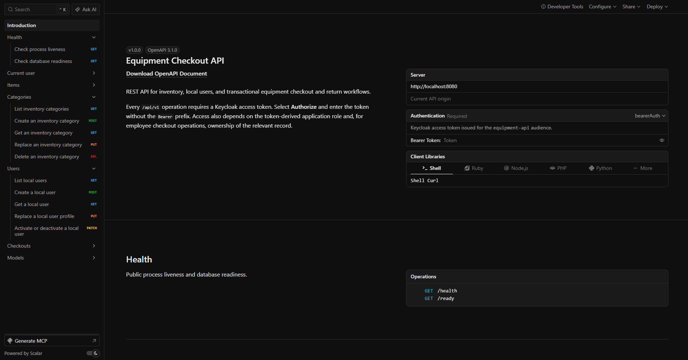
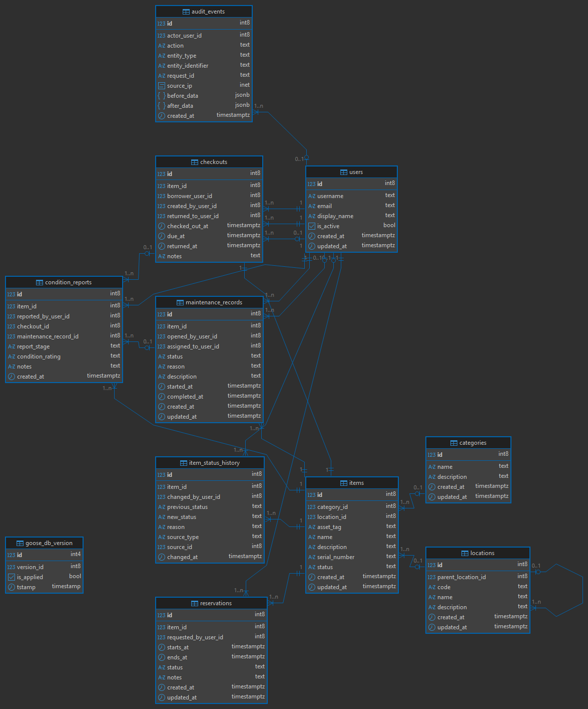

<div align="center">


<h1>Equipment Checkout System</h1>
<p>
A backend-only Go REST API for managing equipment, categories, local users, and
transactional checkout and return workflows. PostgreSQL is the system of record,
Keycloak provides OAuth 2.0/OpenID Connect authentication and role-based access,
and every protected request carries a trusted local actor through the HTTP,
service, persistence, history, and audit layers.

```mermaid
flowchart LR
    A["Scalar, Postman, Bruno, or another HTTP client"] --> B["Echo v5 global middleware"]
    B --> C["Route registration"]
    C --> D{"Public route?"}

    D -- "Yes: health, readiness, or enabled API docs" --> E["Public handler"]
    D -- "No: /api/v1" --> F["Bearer authentication middleware"]

    F --> G["OIDC verifier and cached Keycloak JWKS"]
    G --> H["Exact issuer and subject identity resolution"]
    H --> I["Existing exact linked local user"]
    I --> J["Capability authorization middleware"]
    J --> K["HTTP handler"]

    E --> L["HTTP response"]
    K --> M["Domain service"]
    M --> N["sqlc query or database transaction"]
    M --> Q["Bounded Keycloak Admin API adapter"]
    N --> O["pgxpool"]
    O --> P["PostgreSQL"]
    P --> N
    N --> M
    M --> K
    K --> L
    Q --> M
```

</p>

</div>



## Project structure

```text
.
├── Makefile
├── README.md
├── compose.yaml
├── api-collections/
│   ├── Equipment Checkout API.opencollection.yml
│   └── Equipment Checkout API.postman_collection.json
├── docs/
│   ├── imgs/
│   │   └── equipment_checkout_system_ERD.png
│   └── keycloak-security-verification.md
├── keycloak/
│   ├── realms/
│   │   └── equipment-realm.json
│   └── scripts/
│       └── bootstrap-development-users.sh
└── server/
    ├── api_docs/
    ├── cmd/
    ├── config/
    ├── db/
    │   ├── migrations/
    │   ├── queries/
    │   ├── scripts/
    │   ├── seeds/
    │   ├── sqlcgen/
    │   └── sqlc.yaml
    ├── handlers/
    ├── logger/
    ├── middleware/
    ├── openapi/
    ├── routes/
    ├── services/
    ├── types/
    ├── utils/
    ├── .env.example
    ├── Dockerfile
    ├── go.mod
    └── go.sum
```

## Scalar API reference

available at `http://localhost:8080/scalar/` after `make compose-up`. The raw OpenAPI 3.1 document is available at `http://localhost:8080/openapi.yaml`



## ERD diagram



## Project configuration

<details>
<summary><strong>Show project configuration</strong></summary>

### Prerequisites

- Docker with Docker Compose
- GNU Make
- Go `1.26.4` when running the API or development tools on the host

### Local environment

Create the ignored local configuration file:

```powershell
Copy-Item server/.env.example server/.env
```

Replace all development password examples in `server/.env`. Do not commit this
file or place real credentials in `server/.env.example`.

### Application and database settings

| Variable                     | Purpose                                                                   |
| ---------------------------- | ------------------------------------------------------------------------- |
| `APP_ENV`                    | Runtime environment; development-only data commands require `development` |
| `HTTP_HOST`                  | API bind host                                                             |
| `HTTP_PORT`                  | API host and published port                                               |
| `API_DOCS_ENABLED`           | Registers the public Scalar UI and embedded OpenAPI document when `true`  |
| `DATABASE_URL`               | Host-side PostgreSQL connection string                                    |
| `POSTGRES_DB`                | Application database name                                                 |
| `POSTGRES_USER`              | Application database user                                                 |
| `POSTGRES_PASSWORD`          | Application database password                                             |
| `POSTGRES_PORT`              | Host-published application database port                                  |
| `DB_MAX_CONNECTIONS`         | Maximum pgxpool connections                                               |
| `DB_MIN_CONNECTIONS`         | Minimum pgxpool connections                                               |
| `DB_MAX_CONNECTION_LIFETIME` | Maximum pooled connection lifetime                                        |

PostgreSQL is required at runtime. The API fails startup when the application
database is unavailable and does not provide an in-memory fallback.

### OIDC settings

| Variable            | Purpose                              |
| ------------------- | ------------------------------------ |
| `OIDC_ISSUER_URL`   | Exact accepted Keycloak issuer       |
| `OIDC_JWKS_URL`     | JWKS endpoint used by a host-run API |
| `OIDC_AUDIENCE`     | Required access-token audience       |
| `OIDC_HTTP_TIMEOUT` | Timeout for OIDC network operations  |
| `OIDC_CLOCK_SKEW`   | Accepted token time-claim skew       |

Compose uses Keycloak's internal service address for JWKS while preserving the
public localhost issuer configured in `OIDC_ISSUER_URL`.

### Keycloak settings

| Variable                            | Purpose                                          |
| ----------------------------------- | ------------------------------------------------ |
| `KEYCLOAK_HTTP_PORT`                | Loopback port for Keycloak and its Admin Console |
| `KEYCLOAK_POSTGRES_DB`              | Dedicated Keycloak database name                 |
| `KEYCLOAK_POSTGRES_USER`            | Dedicated Keycloak database user                 |
| `KEYCLOAK_POSTGRES_PASSWORD`        | Dedicated Keycloak database password             |
| `KEYCLOAK_POSTGRES_VOLUME_NAME`     | Exact persistent Keycloak volume name            |
| `KEYCLOAK_BOOTSTRAP_ADMIN_USERNAME` | Development Admin Console username               |
| `KEYCLOAK_BOOTSTRAP_ADMIN_PASSWORD` | Development Admin Console password               |
| `KEYCLOAK_EQUIPMENT_ADMIN_PASSWORD` | `equipment.admin` password                       |
| `KEYCLOAK_SAMPLE_BORROWER_PASSWORD` | `sample.borrower` password                       |
| `KEYCLOAK_AUDIT_VIEWER_PASSWORD`    | `audit.viewer` password                          |
| `KEYCLOAK_ADMIN_URL`                | Host-side Keycloak Admin API base URL            |
| `KEYCLOAK_REALM`                    | Managed Keycloak realm                           |
| `KEYCLOAK_USER_SYNC_CLIENT_ID`      | Confidential user-management service client      |
| `KEYCLOAK_USER_SYNC_CLIENT_SECRET`  | Ignored service-account client secret             |
| `KEYCLOAK_ADMIN_TIMEOUT`            | Timeout for one administration operation         |

The committed realm JSON is canonical development configuration. It is imported
only when the `equipment` realm is absent; an ordinary restart does not import
later JSON changes into an existing realm. The repeatable bootstrap does reapply
the ignored service-account secret, its limited roles, the theme, and the three
representative passwords. Reset a disposable Keycloak volume after canonical
realm changes.

</details>

## Run the project with Docker and Make

<details>
<summary><strong>Show Docker and Make instructions</strong></summary>

### Full Docker Compose environment

After creating `server/.env`, run:

```text
make compose-up
make migrate-status
make seed-dev
```

`make compose-up` builds and starts the application PostgreSQL database,
migrations, Keycloak PostgreSQL database, Keycloak, development-user bootstrap,
and API. It waits until the required services are ready. `make seed-dev` is
optional and loads repeatable development users, inventory, and workflow data.

The API is then available at `http://localhost:8080`, the Scalar API reference
is available at `http://localhost:8080/scalar/`, and the Keycloak Admin Console
is available at `http://localhost:8081/admin`.

### Run the API on the host

Keep PostgreSQL and Keycloak in Docker while running Go on the host:

```text
make db-up
make keycloak-up
make migrate-up
make run
```

Useful development commands:

```text
make build
make migrate-status
make sqlc
make inspect-token
make reconcile-users
```

### Direct Docker Compose commands

If GNU Make is unavailable:

```powershell
docker compose --env-file server/.env up --detach --build --wait
docker compose --env-file server/.env down
```

### Cleanup

Stop Keycloak while preserving its database:

```text
make keycloak-stop
```

Stop the complete project while preserving both PostgreSQL volumes:

```text
make compose-down
```

The following commands are destructive and require explicit confirmation:

```text
make reset-dev CONFIRM=YES
make keycloak-reset CONFIRM=YES
make compose-down-volumes CONFIRM=YES
```

- `reset-dev` deletes all application rows while preserving migration history.
- `keycloak-reset` deletes only the configured Keycloak PostgreSQL volume, then
  reimports and bootstraps the development realm.
- `compose-down-volumes` deletes both application and Keycloak database volumes.

</details>

## Explore the API with Scalar

<details>
<summary><strong>Show Scalar API reference instructions</strong></summary>

The development configuration enables the embedded OpenAPI reference. After
`make compose-up`, open:

```text
http://localhost:8080/scalar/
```

`http://localhost:8080/scalar` redirects to the canonical trailing-slash URL.
The raw OpenAPI 3.1 document is available at
`http://localhost:8080/openapi.yaml`.

Scalar UI options live in
[`server/api_docs/bootstrap.js`](server/api_docs/bootstrap.js). The embedded
development configuration disables Scalar Agent and developer tools. Rebuild
the API after changing the theme or other UI options.

Scalar loads a version-pinned browser bundle from jsDelivr and sends test
requests directly to the same API origin; no Scalar request proxy is used.
Select **Authorize**, paste a Keycloak access token without the `Bearer` prefix,
and then send protected requests from the operation pages. The existing
authentication, capability, and ownership rules apply unchanged.

These documentation routes are public whenever `API_DOCS_ENABLED=true`. Set it
to `false` for deployments where the API contract must not be exposed. When
disabled, the routes are not registered.

</details>

## Test three endpoints with Postman or Bruno

<details>
<summary><strong>Show API testing instructions</strong></summary>

Import one of the bundled collections:

- Postman:
  [`Equipment Checkout API.postman_collection.json`](<api-collections/Equipment Checkout API.postman_collection.json>)
- Bruno:
  [`Equipment Checkout API.opencollection.yml`](<api-collections/Equipment Checkout API.opencollection.yml>)

The collection is configured for Authorization Code with PKCE:

| Setting           | Development value                                                      |
| ----------------- | ---------------------------------------------------------------------- |
| Authorization URL | `http://localhost:8081/realms/equipment/protocol/openid-connect/auth`  |
| Access token URL  | `http://localhost:8081/realms/equipment/protocol/openid-connect/token` |
| Client ID         | `equipment-postman`                                                    |
| Client secret     | Empty                                                                  |
| Callback URL      | `https://oauth.pstmn.io/v1/browser-callback`                           |
| Scope             | `openid`                                                               |
| PKCE method       | `S256`                                                                 |
| Token placement   | `Authorization: Bearer <access-token>`                                 |

In Postman, use **Get New Access Token** and then **Use Token**. In Bruno, use
**Get Access Token**. Sign in as `equipment.admin` with the password configured
by `KEYCLOAK_EQUIPMENT_ADMIN_PASSWORD`. Protected requests inherit the
collection-level OAuth configuration.

### 1. Process health

```http
GET http://localhost:8080/health
```

Expected response:

```text
200 OK
healthy
```

This endpoint is public and never contacts PostgreSQL.

### 2. Current authenticated user

```http
GET http://localhost:8080/api/v1/me
Authorization: Bearer <access-token>
```

Expected response shape:

```json
{
  "data": {
    "id": 1,
    "username": "equipment.admin",
    "email": "admin@example.test",
    "display_name": "Equipment Administrator",
    "role": "inventory_admin",
    "is_active": true,
    "created_at": "2026-07-29T00:00:00Z",
    "updated_at": "2026-07-29T00:00:00Z"
  }
}
```

IDs and timestamps depend on the current database. Sending this request without
a Bearer access token returns `401 authentication_required`.

### 3. List inventory items

```http
GET http://localhost:8080/api/v1/items
Authorization: Bearer <access-token>
```

Expected response shape after `make seed-dev`:

```json
{
  "data": [
    {
      "id": 1,
      "category_id": 1,
      "asset_tag": "EQ-LAP-001",
      "name": "Development Laptop",
      "description": "Sample laptop for local development",
      "serial_number": "DEV-LAPTOP-001",
      "status": "available",
      "created_at": "2026-07-29T00:00:00Z",
      "updated_at": "2026-07-29T00:00:00Z"
    }
  ]
}
```

The list may contain additional records. Employees, auditors, and inventory
administrators can read inventory; only inventory administrators can mutate it.

</details>

## Keycloak integration

<details>
<summary><strong>Show Keycloak integration details</strong></summary>

Keycloak `26.7.0` runs with a dedicated PostgreSQL database and supplies signed
access tokens to the API. Every `/api/v1` route requires exactly one Bearer
access token. The API verifies the RS256 signature, issuer, audience, subject,
lifetime, and realm-role claim shape using cached JWKS data.

After verification, the API resolves the exact token `(issuer, subject)` to an
active, already-linked local `users.id`. Unknown Keycloak identities receive
`403 identity_not_linked`; authentication never creates a local row. Tokens
must contain exactly one recognized application realm role.

The application API is the supported administrative entry point. It uses a
bounded GoCloak adapter to synchronously mirror user creation, profile, role,
and activation changes to Keycloak and PostgreSQL. PostgreSQL stores the
intended single role in `users.role`; authorization still comes from the
verified token role. Keycloak and the application keep separate databases, and
the application never connects to Keycloak's PostgreSQL database.
GoCloak is used only for administration; access-token verification remains on
the existing `coreos/go-oidc` boundary.

`UserService` owns each synchronous two-store mutation. It locks and snapshots
the local row, asks Keycloak to replace the complete managed profile, role, and
activation state with one bounded service token, writes that same state to
PostgreSQL, and returns success only after the database commit. If Keycloak may
have changed but the replacement or local commit fails, the service makes one
bounded attempt to restore the snapshot and leaves reconciliation as the
explicit recovery path if restoration also fails.

| Keycloak realm role | Application access                                                                  |
| ------------------- | ----------------------------------------------------------------------------------- |
| `employee`          | `/me`, inventory reads, self checkout/return, and own checkout reads                |
| `auditor`           | `/me`, inventory reads, all checkout reads, and item-wide history                   |
| `inventory_admin`   | All current routes, including inventory and user management and on-behalf workflows |

The canonical development users are:

| Username          | Role              | Password variable                   |
| ----------------- | ----------------- | ----------------------------------- |
| `equipment.admin` | `inventory_admin` | `KEYCLOAK_EQUIPMENT_ADMIN_PASSWORD` |
| `sample.borrower` | `employee`        | `KEYCLOAK_SAMPLE_BORROWER_PASSWORD` |
| `audit.viewer`    | `auditor`         | `KEYCLOAK_AUDIT_VIEWER_PASSWORD`    |

Managed user routes, all requiring `users.manage`, are:

| Method | Path | Effect |
| --- | --- | --- |
| `POST` | `/api/v1/users` | Create Keycloak identity, realm role, and linked local row |
| `PUT` | `/api/v1/users/:id` | Replace synchronized profile fields |
| `PATCH` | `/api/v1/users/:id/role` | Replace the one application realm role |
| `PATCH` | `/api/v1/users/:id/status` | Synchronize activation state |
| `DELETE` | `/api/v1/users/:id` | Disable both sides while retaining the local row and history |
| `PUT` | `/api/v1/users/:id/temporary-password` | Send a temporary password directly to Keycloak |

Role changes appear in newly issued tokens; an already issued token can retain
its previous role until the five-minute access-token lifetime ends. Deactivation
is checked locally on every request and immediately denies an already issued
token. Temporary passwords are never stored, returned, trimmed, or logged.

`make reconcile-users` is a one-shot migration and recovery tool. It reuses the
same complete-state Keycloak operation to push linked local state, provisions
unlinked local users such as `maintenance.tech`,
and reports Keycloak-only orphans for manual review. It never auto-links by
username or email and never deletes orphans.

The development Admin Console is available at
`http://localhost:8081/admin`. Sign in to the `master` realm with
`KEYCLOAK_BOOTSTRAP_ADMIN_USERNAME` and
`KEYCLOAK_BOOTSTRAP_ADMIN_PASSWORD`, then switch to the `equipment` realm. The
bootstrap administrator is for realm administration and must not be used as an
application actor.

The API authenticates to the Admin API through the confidential
`equipment-user-sync` service account. Bootstrap grants only the realm-management
roles needed to manage users and read realm-role definitions; it does not grant `realm-admin`.
Direct Admin Console edits to application-managed profiles, activation, or
application realm roles are unsupported and may be overwritten by reconciliation.

The `equipment` realm uses the custom login theme in
`keycloak/themes/equipment`. It inherits Keycloak's maintained login templates
and adds project-specific colors, typography, copy, and artwork. Compose mounts
the theme read-only, and the development bootstrap reapplies the theme selection
to existing persisted realms.

Executed security checks, expected response envelopes, implementation-backed
invariants, and the remaining manual acceptance matrix are documented in
[`docs/keycloak-security-verification.md`](docs/keycloak-security-verification.md).

The checked-in Keycloak setup uses development mode and loopback HTTP. It is not
a production identity-platform design; production requires separately reviewed
TLS, issuer stability, proxy trust, secret management, private administration,
backup and recovery, monitoring, upgrades, key rotation, and revocation policy.

</details>
